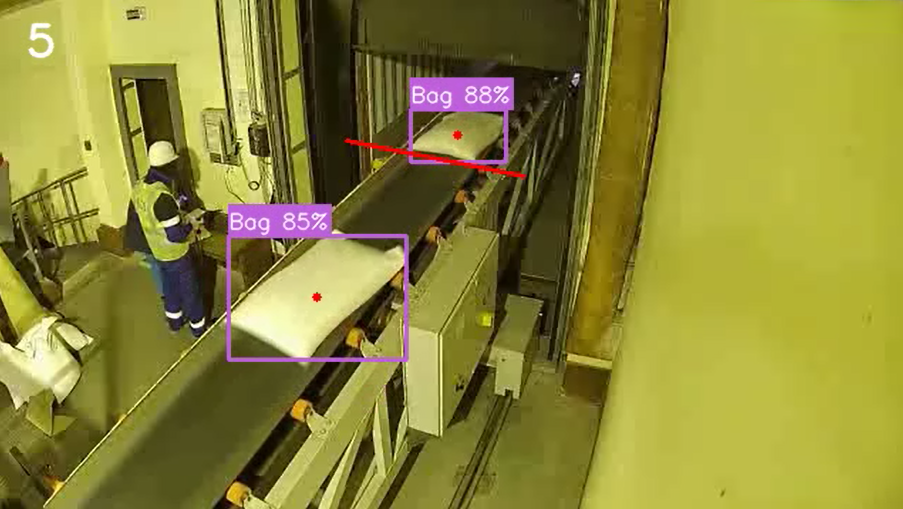
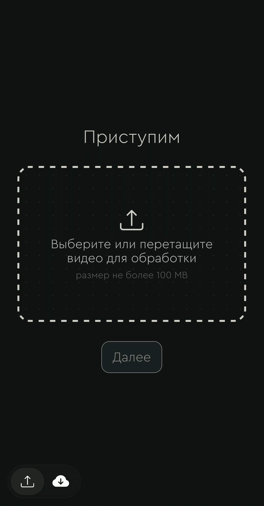
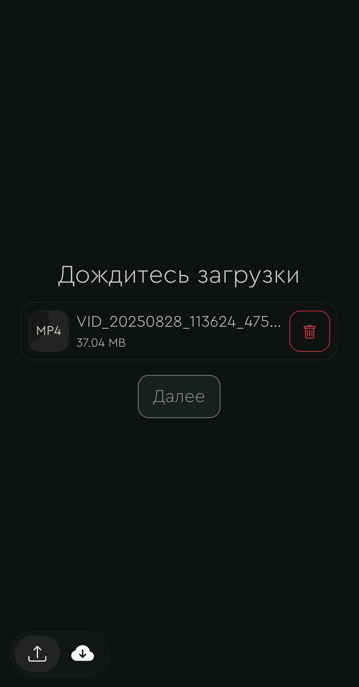
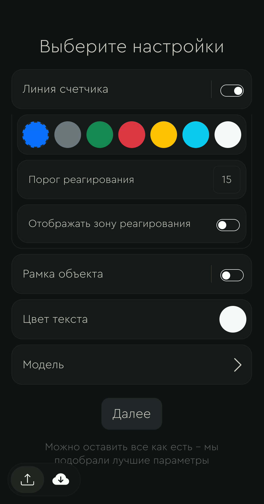
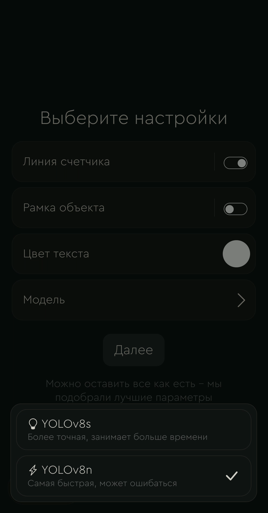
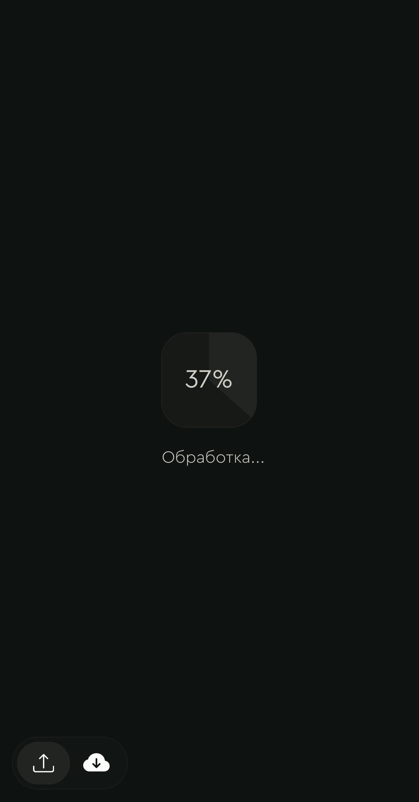
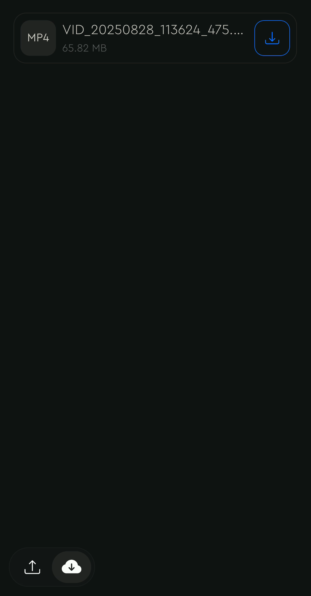

# 🧳 Bag Counting App

Bag Counting App – приложение для автоматического анализа видео с конвейерной ленты, подсчета мешков и настройки параметров обработки через удобный интерфейс. 🚀

  
*Пример полученного видео*

## 📋 Описание

Приложение позволяет загружать видеофайлы, обрабатывать их с учетом выбранных параметров и просматривать результаты в реальном времени. Основные функции включают:
- Загрузка видео через выбор файла или drag-and-drop.
- Настройка параметров обработки (например, зона реагирования подсчета, отображение рамки детекции, выбор цвета текста).
- Отображение прогресса обработки в реальном времени.
- Хранение и отображение списка обработанных видео для каждого пользователя.

## 🛠 Установка

Для запуска приложения используйте Docker. Следуйте этим шагам:

1. **Сборка образа**:
   ```bash
   docker build -t bag-counting-app .
   ```

2. **Запуск контейнера**:
   ```bash
   docker run -d -p 8000:8000 --name bag-counting-container -v bag-counting-volume:/app/volume -v bag-counting-uploads:/app/uploads bag-counting-app
   ```

После запуска приложение будет доступно по адресу: [http://localhost:8000](http://localhost:8000).

## 🚀 Как работает

1. **Загрузка видео** 📤  
   Пользователь выбирает видеофайл или перетаскивает его в интерфейс. Видео автоматически загружается на сервер, где ему присваивается уникальный идентификатор.

2. **Настройка параметров** ⚙️  
   После загрузки пользователь может:
   - Включить/отключить отображение линии подсчета.
     - выбрать цвет линии;
     - ввести порог реагирования полосы подсчета;
     - включить/отключить отображение порога реагирования;
   - Включить/отключить отображение рамки детекции
     - выбрать цвет рамки;
     - включить/отключить отображение наименования классов;
     - включить/отключить отображение вероятности класса;
     - включить/отключить отображение центров рамки;
    - Выбрать цвет текста видео.
    - Выбрать модель для подсчета объектов.

3. **Обработка видео** ⏳  
   После нажатия кнопки "Далее" запускается обработка с отображением прогресса в реальном времени.

4. **Результат** 🎉  
   После завершения обработки пользователь автоматически перенаправляется на страницу со списком всех его обработанных видео.

## 🔮 Что стоило бы добавить

- **Выбор полосы счетчика** для более точной обработки.
- **Обрезка видео** для работы только с нужными фрагментами.
- **Анимации** для улучшения пользовательского опыта.
- **Фронтенд на React** для современного и отзывчивого интерфейса.
- **Изоляция uploads и volume** для повышения безопасности и производительности.
- **Авторизация через PostgreSQL** для защиты пользовательских данных.
- **Redis для пулинга задач** и ускорения обработки.
- **Пропуск кадров** для оптимизации производительности при обработке длинных видео.

## 🛠 Технологии

- **Backend**: Python (FastAPI, OpenCV, YOLO).
- **Frontend**: Bootstrap 5, Jinja2 для шаблонов
- **Контейнеризация**: Docker.

## 📷 Скриншоты

  
*Интерфейс выбора файла*

  
*Процесс загрузки файла*

  
*Интерфейс настроек обработки (пункты меню)*

  
*Интерфейс настроек обработки (выбор модели)*

  
*Отображение процесса обработки видео*

  
*Список обработанных видео*

<video controls>
  <source src="media/screenrecorded.mp4" type="video/mp4">
  Ваш браузер не поддерживает видео.
</video>

<video controls>
  <source src="media/output_video (cut).mp4" type="video/mp4">
  Ваш браузер не поддерживает видео.
</video>

## 📧 Контакты

[Telegram](https://t.me/@brmi1)  
[Почта](mailto:hii.brmi@gmail.com)
